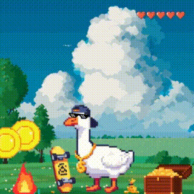

# Web3 P2E Gu$$I Coin Endless Runner

**Game project for The Open League Hackaton at Minsk 7-9 June 2024, TON Community Belarus**

## Overview

Welcome to the Web3 P2E Gu$$I Coin Endless Runner, an exciting and innovative Play-to-Earn (P2E) game designed for the TON Community Belarus and showcased at The Open League Hackaton in Minsk. This game combines the thrill of endless running with the rewards of Web3 technology, allowing players to collect Jetton coins, earn bonuses, and stay alive as long as possible.

## Features

- **Collect Jetton Coins**: Gather as many Jetton coins as you can while navigating through the game.
- **Avoid Fireplaces**: Dodge obstacles such as fireplaces to keep running and earn more coins.
- **Invite Friends**: Invite your friends to play and earn Jetton bonuses together.
- **Bonus Health Points**: Log in every 3 hours to collect bonus health points and keep your character in the game.
- **Discover Hidden Boosts**: Stay alive and explore the game to find hidden boosts that can enhance your gameplay.

## Coming Soon

- **Jetton Listing**: Stay tuned for the official listing of Jetton coins.

Join the fun, earn rewards, and experience the future of gaming with our Web3 P2E endless runner game!

